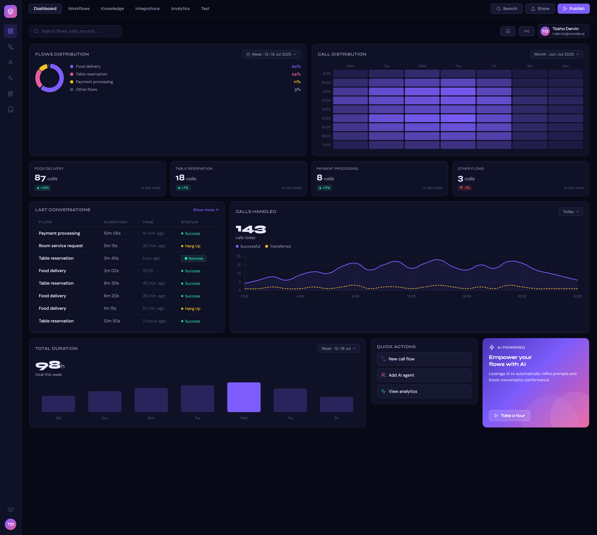
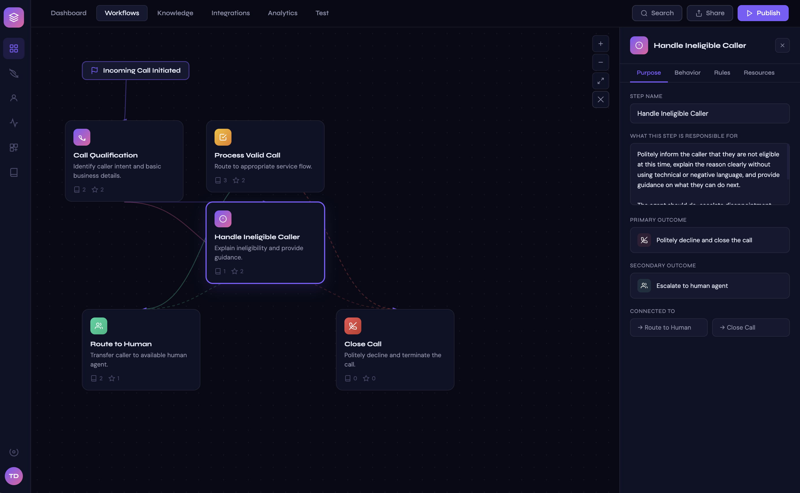

# Revolab Software Engineering Assessment

## Overview

This take-home assessment evaluates your engineering skills using a real-world product interface: an **AI-powered call centre workflow management platform**. The platform allows operators to build call routing flows with AI agents, monitor live call analytics, and manage conversation outcomes.

Two reference screenshots are provided in the `ui/` folder:

### Admin Dashboard


### Workflow Builder


Read the track that applies to your role. Both tracks share the same product domain.

---

## Track A — Frontend Engineer

### What to Build

Replicate the UI shown in the two reference screenshots as closely as possible using **ReactJS**. You are free to choose any component library you are comfortable with (e.g. Tailwind CSS, MUI, Shadcn/ui, Ant Design, Chakra UI).

The implementation must be **functional**, not just visual. Reviewers will interact with the app, so state must respond to user actions.

### Screens Required

#### 1. Admin Dashboard

Replicate the dashboard including:

- **Top navigation bar** — tabs: Dashboard, Workflows, Knowledge, Integrations, Analytics, Tool; action buttons: Search, Share, Publish; user avatar with name
- **Summary metric cards** — Active Users, Free Coordinates, Prompt Processing, Retry Links; each with a count, trend badge (percentage + direction), and a sub-label
- **Flows Distribution chart** — donut/pie chart with a legend showing flow types (Food delivery, Table reservation, Payment processing, Other flows) and their percentages
- **Call Distribution chart** — heatmap or grouped bar chart across days of the week
- **Last Conversations table** — columns: Flow, Subscription, Time, Status; status badge variants: Success, Hang Up; pagination or "show more" control
- **Calls Handled chart** — line or area chart with a total call count (143), split between Successful and Unsuccessful series; date range selector
- **Total Duration chart** — bar chart with an aggregate duration value (98s); week selector
- **Quick Actions panel** — buttons: New call flow, Add AI agent, View analytics
- **AI Powered banner** — promotional card with a CTA "Take a tour"

#### 2. Workflow Builder

Replicate the workflow canvas including:

- **Top navigation** — same tab bar as the dashboard, with Workflows tab active; Search, Share, Publish buttons
- **Canvas** — drag-aware area displaying a flow graph with the following node types:
  - **Trigger node** — "Incoming Call Initiated"
  - **Process nodes** — Call Qualification, Process Valid Call, Handle Ineligible Caller, Route to Human, Close Call
  - Each node shows a title, a short description, and like/dislike counters
  - Edges (arrows) connecting the nodes
- **Zoom controls** — zoom in / zoom out / fit buttons on the canvas
- **Node detail side panel** (opens when a node is clicked) — shows:
  - Step Name (editable text field)
  - "What this step is responsible for" (editable textarea)
  - Primary Outcome (with icon)
  - Secondary Outcome (with icon)
  - Connected To (showing outgoing destination nodes as pills/chips)
  - Close (×) button

### State Management Requirements

The following interactions must work end-to-end:

| Interaction | Expected behaviour |
|---|---|
| Click a nav tab | Active tab highlights; the matching view renders |
| Click a workflow node on the canvas | Side panel slides open and displays that node's data |
| Edit the Step Name or description in the side panel | Input value updates in local state |
| Click the × button on the side panel | Panel closes |
| Click "New call flow" in Quick Actions | At minimum show a toast, modal, or navigate to the workflow view |
| Date range / week selectors on charts | Charts re-render with the selected range (mock data is fine) |
| Status badge in the conversations table | Correctly renders colour-coded variants (Success = green, Hang Up = yellow) |

### Deliverables

- A Git repository (GitHub, GitLab, or Bitbucket) containing your source code
- A `README.md` inside your project with clear instructions to run the app locally
- The app must run with a single command (e.g. `npm install && npm run dev`)

### Evaluation Criteria

| Area | What reviewers look for |
|---|---|
| Visual fidelity | How closely the UI matches the reference screenshots |
| State management | Clean, predictable state; no unnecessary re-renders |
| Component design | Sensible decomposition; reusable, well-named components |
| Code quality | Readable, consistent, maintainable |
| Interactivity | All required interactions work without errors |

### Bonus — Backend Integration

Demonstrate full-stack capability by building a lightweight backend in any language that your React app can call:

- A REST API that serves dashboard metrics and workflow node data
- At least one writable endpoint (e.g. `PATCH /workflows/:id/steps/:stepId` to update a node)
- Basic data models / schemas for flows, steps, and call records
- Document the endpoints (Swagger, Postman collection, or a table in your README)

---

## Track B — Backend Engineer

### What to Build

Design and implement a backend MVP for the same AI-powered call centre platform using **Golang**. The UI is provided only as a product reference — a working frontend is not required.

The deliverable must demonstrate production-quality backend engineering: clean architecture, clearly defined APIs, well-structured data models, and a written system design.

### Core Domain Concepts

Derive your data model and API surface from the product reference:

| Concept | Description |
|---|---|
| **Workflow** | A named call routing flow composed of ordered steps (e.g. "Food delivery") |
| **Step** | A single node in a workflow; has a type, description, primary outcome, secondary outcome, and connections to other steps |
| **Call Record** | A log of a completed call: which workflow was used, duration, subscription type, outcome status (Success / Hang Up) |
| **Agent** | An AI or human agent that can be assigned to handle a step |
| **Metric Snapshot** | Aggregated analytics: active users, calls handled, duration distributions |

### Architecture Design

Include an `ARCHITECTURE.md` (or a dedicated section in your README) that covers:

1. **System overview** — a diagram or structured description of the major components (API layer, service layer, data layer, any async processing)
2. **API design** — all endpoints with method, path, request/response shape, and status codes (see the required endpoints below)
3. **Data models** — entity definitions with field names, types, and relationships
4. **Key design decisions** — explain choices around data storage, concurrency, error handling, and any trade-offs
5. **Scalability considerations** — how the design handles increased call volume or more complex workflows

### Required API Endpoints

Implement at minimum the following:

#### Workflows

```
GET    /api/v1/workflows                    List all workflows
POST   /api/v1/workflows                    Create a workflow
GET    /api/v1/workflows/:id                Get a workflow with its steps
PATCH  /api/v1/workflows/:id                Update workflow metadata
DELETE /api/v1/workflows/:id                Delete a workflow
```

#### Steps (Workflow Nodes)

```
POST   /api/v1/workflows/:id/steps          Add a step to a workflow
GET    /api/v1/workflows/:id/steps/:stepId  Get a single step
PATCH  /api/v1/workflows/:id/steps/:stepId  Update step details
DELETE /api/v1/workflows/:id/steps/:stepId  Remove a step
POST   /api/v1/workflows/:id/steps/:stepId/connections   Link a step to another step
DELETE /api/v1/workflows/:id/steps/:stepId/connections/:targetId  Remove a connection
```

#### Call Records

```
GET    /api/v1/calls                        List call records (support filtering by workflow, date range, status)
POST   /api/v1/calls                        Create a call record (simulate inbound call logging)
GET    /api/v1/calls/:id                    Get a single call record
```

#### Analytics

```
GET    /api/v1/analytics/summary            Return aggregate metrics (active users, total calls, avg duration, etc.)
GET    /api/v1/analytics/calls-handled      Return calls-handled time-series data
GET    /api/v1/analytics/flow-distribution  Return breakdown of calls per workflow/flow type
```

### Technical Requirements

- **Language**: Go (1.21+)
- **HTTP framework**: Standard library (`net/http`) or a lightweight framework (e.g. Gin, Echo, Chi) — your choice, be ready to justify it
- **Database**: Any relational or document store you prefer (PostgreSQL recommended); include a schema migration file or seed script so reviewers can run the DB locally
- **Project structure**: Follow idiomatic Go project layout — separate `cmd`, `internal`, and optionally `pkg` directories
- **Error handling**: Consistent HTTP error responses with meaningful status codes and messages
- **Validation**: Request body validation before hitting the service layer
- **Tests**: Unit tests for at least the service layer; integration tests are a bonus

### Deliverables

- A Git repository with your source code
- A `README.md` with:
  - Local setup instructions (Docker Compose preferred so reviewers can spin up the DB and server with one command)
  - How to run tests
  - A brief explanation of your project layout
- An `ARCHITECTURE.md` (or equivalent section) covering the points listed above

### Evaluation Criteria

| Area | What reviewers look for |
|---|---|
| Architecture clarity | Clear separation of concerns; service and repository layers are distinct |
| API design | RESTful, consistent naming, correct HTTP semantics |
| Data modelling | Normalised schema, appropriate indexes, sensible relationships |
| Go idioms | Error handling, struct design, interface use, context propagation |
| Code quality | Readable, testable, consistent formatting (`gofmt`/`golangci-lint`) |
| Documentation | Architecture doc is clear enough that a new engineer could understand the system |

### Bonus

- Middleware: request logging, authentication (JWT or API key), rate limiting
- Background job: a worker that periodically aggregates call records into metric snapshots
- WebSocket or SSE endpoint: push real-time call events to a connected dashboard client
- Docker Compose file that starts the API server and database together

---

## Submission

1. Push your code to a public or private repository and share access with the interviewer
2. Send the repository link along with any notes about known limitations or things you would do differently given more time
3. Be prepared to walk the interviewer through your code, explain your decisions, and make live changes during the technical interview

**Time budget**: 1–2 days. Prioritise working code and clear thinking over completeness. A focused, well-explained MVP is valued more than a sprawling but untidy submission.

---

*Questions? Reach out to your Revolab contact before starting.*
